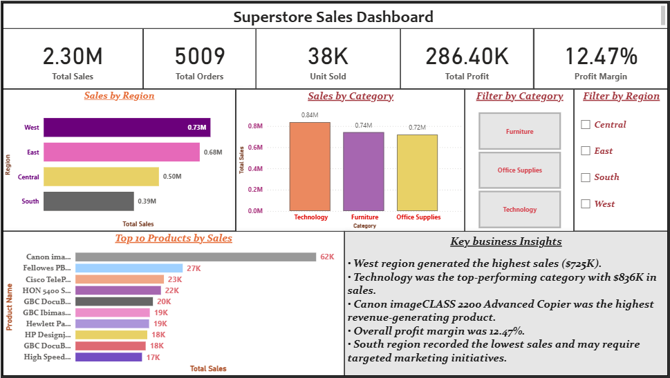

# Superstore Sales Dashboard

## Dashboard Preview

## Project Overview

This project analyzes sales performance using the Superstore dataset and presents business insights through an interactive Power BI dashboard.

## Tools Used

* Microsoft Excel
* Power BI
* Power Query
* DAX

## Key KPIs

* Total Sales: 2.30M
* Total Orders: 5009
* Total Quantity: 38K
* Total Profit: 286.40K
* Profit Margin: 12.47%

## Dashboard Features

* Sales by Region Analysis
* Sales by Category Analysis
* Top 10 Products by Sales
* Interactive Region Filter
* Interactive Category Filter
* Business Insights Section

## Key Business Insights

* West region generated the highest sales ($725K).
* Technology was the top-performing category with $836K in sales.
* Canon imageCLASS 2200 Advanced Copier was the highest revenue-generating product.
* Overall profit margin was 12.47%.
* South region recorded the lowest sales and may require targeted marketing initiatives.

## Files Included

* Superstore_sales_analysis.pbix
* Sample - Superstore.csv
* Sales_Analysis_Dashboard.png

## Author

Jayababu
